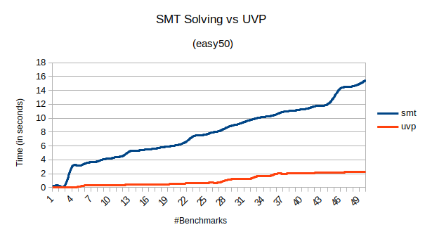
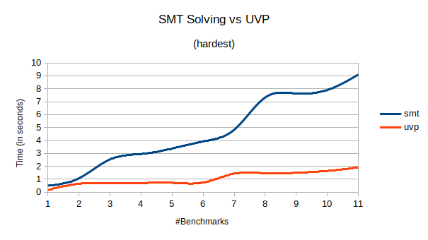
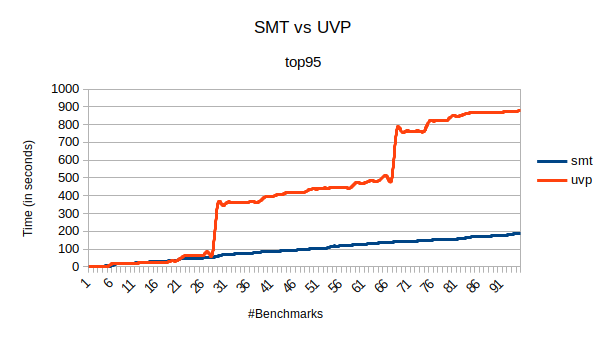

# Introduction

In a classical Sudoku puzzle, a 9x9 grid is given, which is partially filled. The player must fill the empty cells of the grid such that the numbers `[1,9]` appear uniquely in each row, column and 9 subgrids size 3x3. This project automatically finds a solution to a given Sudoku puzzle.

# Algorithms
A brute-force algorithm to solve a Sudoku puzzle involves enumerating values between `[1,9]` for each empty cell and then checking whether they are valid. The time complexity of such an algorithm will be exponential in the number of empty cells. Therefore, one would hope to find a better solution. However, this problem has been proven to be [NP-Complete](https://search.ieice.org/bin/summary.php?id=e86-a_5_1052), making it unclear whether a better algorithm exists.

In this project, I have developed two methods to solve this problem:
1) Specifying the problem as constraints and then using a general-purpose constraint solver.
2) Improving the brute force algorithm by using the concept of unit value propagation.

The first technique demonstrates when a problem's constraints are expressible in a suitable language, a general-purpose solver can be used tofind a solution. Meanwhile, the second technique uses a commonly used method by humans to reduce the number of possible values for each cell.  

## Satisfiability Modulo Theories (SMT) Solver 

The informal constraints of the Sudoku puzzle mentioned in the introduction can be precisely expressed in [first-order logic](https://en.wikipedia.org/wiki/First-order_logic) (also expressible in [propositional logic](https://en.wikipedia.org/wiki/Propositional_logic), but I use first-order logic for brevity). Once the constraints and paritally filled Sudoku grid are expressed in first-order logic, we can use general purpose [SMT](https://en.wikipedia.org/wiki/Satisfiability_modulo_theories) solvers like [Z3](https://github.com/Z3Prover/z3) to fill the empty cells. The advantage of this approach is that we can solve a problem like Sudoku by just expressing its constraints precisely, without using any new heuristics to solve the problem. For instance, the `sudoku_z3.cpp` contains the constraints.

## Unit Value Propagation (UVP)

Humans typically solve a Sudoku puzzle by eliminating values that cells can have based on the constraints. Then, they guess the values in the reduced space, and backtrack when they are stuck. A computer can do the same, _much faster_. In this algorithm, I use the same approach. First, based on the values present in neighbouring cells, the possible set of values for empty cells are reduced. If the problem is still not solved, a value is guessed from the reduced space and backtracking is applied if the algorithm gets stuck (i.e. there are no possible values possible for an empty cell).   This algorithm is in the `sudoku_uvp.cpp` file.

# Installation

Builds with gcc-9.4.1 (Linux). 

* `cd ottest; mkdir build; cd build`

To build the Backpropagation Algorithm:

* `cmake ..`
* `make`

To build the SMT Algorithm:
* `cmake -U USE_Z3 -D USE_Z3=ON ..`
* `make` downloads and builds Z3 (requires `python` in `PATH`) 
* `make` (again)

After compilation, `ottest` binary has the UVP algorithm and `ottest_z3` has the SMT algorithm. Both will be in present in the `build` directory. You can run any benchmarks from the `benchmarks` directory. For example,

`ottest < ../benchmarks/hardest/bench1`

# Evaluation

To evaluate the approaches, I used the three [publicly available](https://github.com/dimitri/sudoku/blob/master/) benchmarks: `easy50`, `hardest`, and `top95` (present in `benchmarks` directory).  

## Sanity Check
The output of the tools (i.e. solved sudoku) are verified using the method `solved()` present in `sudoku_uvp.cpp`.

## Results
The UVP algorithm takes less time than the SMT algorithm on two benchmark sets (`easy50` and `hardes`), while it takes a significantly more time on a few instances of one benchmark set (`top95`). Figures comparing the total time can be found below.

